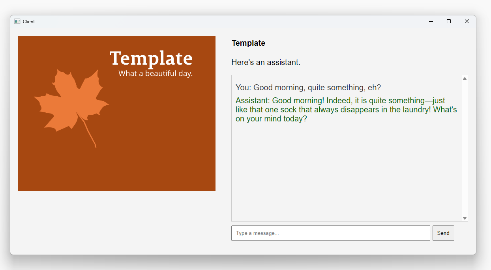

Template for a chatbot passing completions to OpenAI API.

1. **Client** is a small cross-platform desktop app in C# applying [Photino framework](https://www.tryphotino.io/). At startup, the web page and content for the menu is loaded from server. Server instructs client to resize window. Windows shows the web page as UI.

2. **Server** is a single app.js in JavaScript running in Node.js. It serves the web content and forwards chat completions to OpenAI API en returns responses.


I have a later version of this running on Plesk for family. With some additional prompting and taint checking, it's fun and simple to run an assistant on the desktop. Running the UI in a webview, makes the app easy to maintain server-side.


```
cd Client
dotnet publish Client.sln --configuration Release --self-contained
```
```
cd Server
npm install axios
node app.js
```


